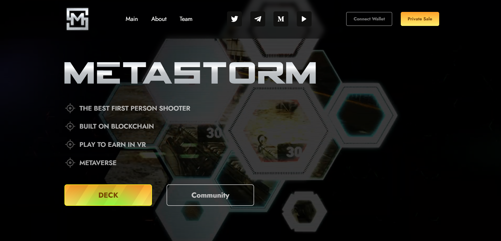

  

  Один из первых "крупных" проектов которые были сделаны в процессе обучения
  
<b>демо:</b> <a href="https://mushketov.github.io/MetaStorm/" target="_blank">MetaStorm</a>

  
<b>макет:</b> <a href="https://www.figma.com/file/G0VuQPQoWKmBP0FIVmSCu3/MetaStorm-info?type=design&t=OCnN7GN63kDaV9o8-0">figma.com</a>

  <b>stack:</b>
  <ul>
    <li>html</li>
    <li>scss</li>
    <li>fancybox</li>
    <li>swiperjs</li>
  </ul>
